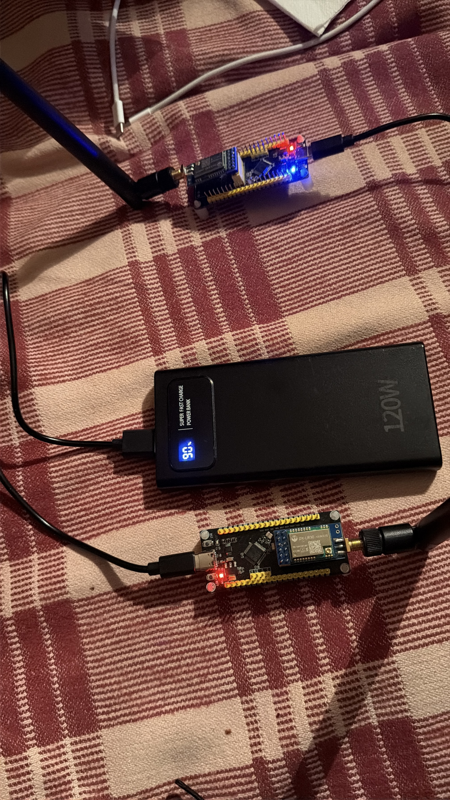
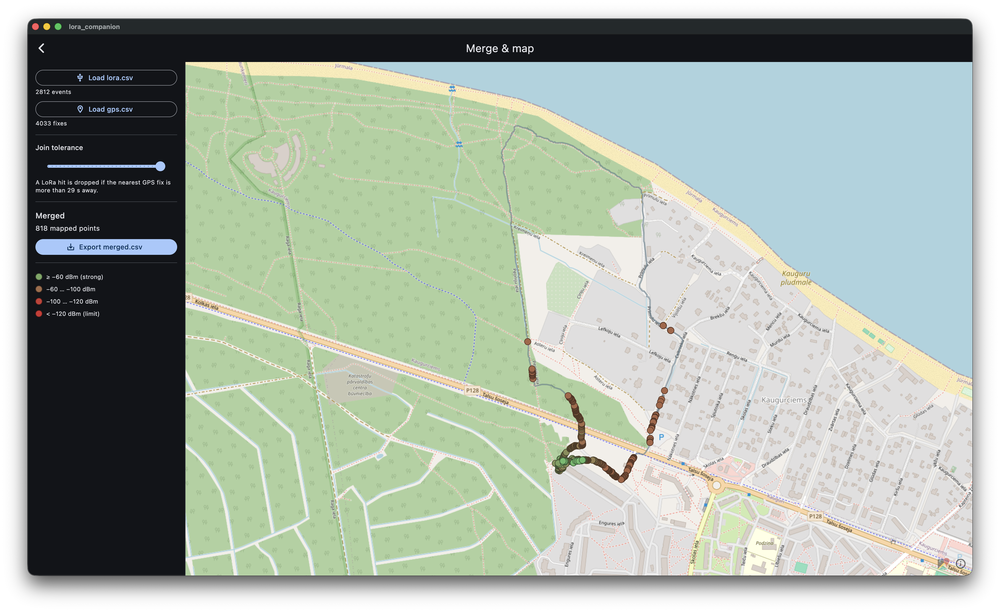

# Architecture

End-to-end view of the LoRa-DX-LR30 range-test rig. Two embedded firmware
images on identical hardware, one Flutter app that runs in two distinct UIs
depending on the host OS, all glued together by a simple text protocol over
LoRa on one side and a CSV-on-disk handoff on the other.

## System overview

```
                ┌───────────────────────┐
walking node →  │ node_a (PING initiator)│
                │ SX1262 + STM32F103C8T6 │
                └──────────┬─────────────┘
                           │
                           │  LoRa 433 МГц, BW=125, CR=4/5
                           │  +22 dBm, 12-byte packet, CRC16-on
                           │  ─────────── air gap ───────────
                           │
                ┌──────────▼─────────────┐
base node →    │ node_b (PONG responder)│
                │ SX1262 + STM32F103C8T6 │
                └──────────┬─────────────┘
                           │ USART1 PA9 (TX) @ 115200 8N1
                           ▼
                ┌───────────────────────┐
                │ on-board CH340 USB-UART│
                └──────────┬─────────────┘
                           │ USB-C  (/dev/cu.usbserial-N on macOS)
                           ▼
                ┌───────────────────────┐
                │ companion (Flutter)    │   ┌─────────────────┐
                │ macOS — usb_capture    │   │ iPhone (Flutter)│
                │   → lora_*.csv         │   │ gps_recorder    │
                │ macOS — map_screen     ├──←│ → gps_*.csv     │
                │   merge by timestamp   │   │ via AirDrop     │
                │   → OSM + RSSI dots    │   └─────────────────┘
                └───────────────────────┘
```

Two physical USB cables involved during a session:
- ST-Link V2 → BluePill SWD (only during flashing; disconnected before the
  field walk to free the USB-C port for the host link)
- USB-C cable → BluePill USB-C → CH340 → MCU USART1 (the data path during
  the actual range test)



Bench bring-up of both nodes: top board carries the whip antenna with its
blue link LED lit (active radio), the bottom DX-LR30 has the SMA antenna and
its red power LED on. Both run untethered off a single 120 W USB-C power bank
(~90 %), which is how the base node stays alive through a multi-hour SF sweep
without a wall socket.

## LoRa link layer

### Packet format (12 bytes, little-endian)

| Offset | Field            | Size | Meaning                                                      |
|--------|------------------|------|--------------------------------------------------------------|
| 0      | `magic`          | u8   | `0xA5` — sanity check, rejects random air noise              |
| 1      | `version`        | u8   | `1` — bumped on any incompatible packet-layout change        |
| 2      | `kind`           | u8   | `0` = PING, `1` = PONG                                       |
| 3      | `sf_index`       | u8   | SF this packet was modulated at; index into `SF_TABLE[0..5]` |
| 4..6   | `seq`            | u16  | Sequence within the current SF round (0..19)                 |
| 6..8   | `echo_rssi`      | i16  | RSSI node_b heard for the PING (only meaningful in PONG)     |
| 8      | `echo_snr`       | i8   | SNR node_b heard for the PING (only meaningful in PONG)      |
| 9      | `next_sf_index`  | u8   | SF the *next* packet will be modulated at — sweep handoff    |
| 10..12 | reserved         | 2 B  | Padding for future fields                                    |

The two reserved bytes are not currently checked, so future versions can use
them without bumping `version` as long as readers default-init them to 0.

### Modulation parameters (compile-time constants)

| Constant            | Value     | Source                          |
|---------------------|-----------|---------------------------------|
| `FREQ_HZ`           | 433 000 000 | `firmware/src/protocol.rs`    |
| `TX_POWER_DBM`      | +22 dBm   | `firmware/src/protocol.rs`      |
| `BANDWIDTH`         | 125 кГц   | `firmware/src/radio.rs`         |
| `CODING_RATE`       | 4/5       | `firmware/src/radio.rs`         |
| `PREAMBLE_LEN`      | 8 symbols | `firmware/src/radio.rs`         |
| `RX_SYMBOL_TIMEOUT` | 200 symbols | `firmware/src/radio.rs`       |
| Sync word           | 0x12 (private LoRa, set by lora-phy default `enable_public_network=false`) | — |
| Header              | Explicit                                              |
| CRC16-CCITT         | **on** (both TX and RX)                               |
| IQ inversion        | off                                                   |

Per-SF sensitivity, ToA, and expected real-world range are tabulated in
[`speed-vs-range.md`](speed-vs-range.md).

### Packet parameters (`lora.create_rx_packet_params` / `create_tx_packet_params`)

The RX side of lora-phy needs one more argument than TX (`max_payload_length`)
because the receiver pre-allocates a buffer; on TX the length is implicit from
the byte slice you pass to `prepare_for_tx`. Otherwise the two sides take the
same parameter set, and the values **must match exactly** on both ends — a
mismatch on any of them and the receiver silently never decodes.

```rust
// Source: lora-phy 3.0.1, src/lib.rs:108
pub fn create_rx_packet_params(
    &mut self,
    preamble_length: u16,
    implicit_header: bool,
    max_payload_length: u8,
    crc_on: bool,
    iq_inverted: bool,
    modulation_params: &ModulationParams,
) -> Result<PacketParams, RadioError>
```

| # | Field                | Type   | Meaning                                                                                            | Our value                |
|---|----------------------|--------|----------------------------------------------------------------------------------------------------|--------------------------|
| 1 | `preamble_length`    | `u16`  | Preamble symbol count                                                                              | `PREAMBLE_LEN = 8`       |
| 2 | `implicit_header`    | `bool` | `false` = explicit header (length/CR/CRC bits in-band); `true` = receiver knows length up-front    | `false`                  |
| 3 | `max_payload_length` | `u8`   | Max payload bytes — sizes the SX126x RX buffer and filters oversize frames *(RX only)*             | `MAX_LORA_PAYLOAD = 32`  |
| 4 | `crc_on`             | `bool` | Enable hardware CRC16-CCITT over payload. On RX, CRC failure raises `IRQ_CRC_ERROR` (frame dropped) | `true`                  |
| 5 | `iq_inverted`        | `bool` | Invert I/Q polarity. LoRaWAN gateway→device uses this; for peer-to-peer keep `false` on both ends   | `false`                  |
| 6 | `modulation_params`  | `&ModulationParams` | SF/BW/CR/freq tuple from `create_modulation_params`. SF-selective, so an SF mismatch means total deafness | `&mod_params` |

`create_tx_packet_params` is identical minus parameter 3 (`max_payload_length`):

```rust
create_tx_packet_params(preamble_length, implicit_header, crc_on, iq_inverted, mod_params)
```

### SF coordination

Naive approach (broken): node_a switches SF unilaterally, embeds the new SF in
the next packet. Doesn't work — LoRa is SF-selective, so node_b can't decode a
packet at the SF it isn't currently tuned to. Chicken-and-egg.

Working approach: `next_sf_index` is **telegraphed over a HANDOFF_TAIL-ping
window** at the end of each round, not just the single final ping. Defined in
`protocol.rs::HANDOFF_TAIL = 3`.

```
node_a (sf_index=K)  ──→ PING(sf_index=K, next_sf_index=K)        ─→ pings 0..16
                         (17 such pings; node_b stays on K)

node_a (sf_index=K)  ──→ PING(sf_index=K, next_sf_index=K+1)      ─→ pings 17,18,19
                         (3-ping handoff window — same `next_sf_index` repeated)
                         node_b updates current_sf_index on the FIRST one it
                         receives. After that node_b is on K+1, so the remaining
                         pings of this round at K are missed (node_a logs PER).

node_a (sf_index=K+1) ─→ PING(sf_index=K+1, next_sf_index=K+1)    ─→ next round
                         node_b is already on K+1, demodulates fine.
```

The single-ping handoff used to desync on every lost final ping. With the
3-ping window, only 1 of 3 needs to make it through:

| Per-ping reliability p | Single-ping handoff loss | 3-ping handoff loss |
|------------------------|--------------------------|---------------------|
| p = 0.9                | 10 %                     | 0.1 %               |
| p = 0.7                | 30 %                     | 2.7 %               |
| p = 0.5                | 50 %                     | 12.5 %              |

**Cost**: when handoff lands on the first of the three pings, node_b retunes
early and node_a sees the remaining 1–2 trailing pings as PER. Effective
measurement window per SF is `PINGS_PER_SF − HANDOFF_TAIL = 17` pings.

**Backup recovery (full window loss)**: on every 60 s rx-timeout, `node_b`
steps `current_sf_index = (current_sf_index + 1) % SF_TABLE.len()` and
re-arms. So even if all three handoff pings are lost, node_b walks the SF
table until it lands on node_a's current SF — worst-case wait is
`SF_TABLE.len() × 60 s = 6 min`. See the `Err(_elapsed)` arm in
`node_b.rs`'s main loop.

**Defensive bounds-check**: `node_b` rejects any `ping.next_sf_index` outside
`[0, SF_TABLE.len())` with `warn!("ignoring out-of-range …")` instead of
latching it in. A real field-capture (Mar 25, `lora_20260525_183403.csv`)
showed a corrupted byte 9 escaping the hardware CRC and stranding the
receiver on SF index 6; without the check the link was stuck for the rest
of the session.

To pin to a single SF instead (e.g. for SF12-only range tests), edit both
bins to set `sf_index = 5` / `current_sf_index = 5`, change node_a's
`next_sf_index` computation to a constant `sf_index`, and disable the scan
arm in node_b. node_a's sweep advance at the end of each round should also
be commented out.

### Round timing

- One round = `PINGS_PER_SF = 20` pings.
- Per-ping cycle = TX-PING (ToA) + turnaround + RX-PONG (ToA) + 50 ms idle.
- After a full round, node_a sleeps 500 ms before the next round.

For SF12/BW125 that's ~2.5 s per ping → ~50 s per round, ~0.4 successful
pings/sec — the slowest end of the trade. For SF7 it's ~7 pings/sec.

## Firmware (Rust + Embassy)

Single Cargo package, two `[[bin]]`s sharing a small `lora_dx_lr30` library:

```
firmware/src/
├── lib.rs            // re-export of the modules below
├── protocol.rs       // Packet encode/decode, SF_TABLE, constants
├── radio.rs          // BANDWIDTH/CR/preamble + DxLr30 Sx126xVariant
├── host_log.rs       // USART1 text logger (Pipe → DMA TX)
└── bin/
    ├── node_a.rs     // PING initiator + per-SF summary
    ├── node_b.rs     // PONG responder + IWDG + 60 s rx-timeout
    └── find_led.rs   // diagnostic — sweeps GPIO pins to locate the LED
```

### Tasks per node

```
node_a executor:
  ├── main          : LoRa init, then the PING/PONG loop
  └── host_log_task : drain HOST_LOG pipe → USART1 DMA

node_b executor:
  ├── main           : LoRa init, then the RX(continuous)/PONG loop
  ├── host_log_task  : drain HOST_LOG pipe → USART1 DMA
  └── watchdog_task  : pet IWDG every 2 s (timeout 8 s)
```

`main` owns the `LoRa<Sx126x<…>, Delay>` driver instance (it carries the
SPI bus, NSS, reset, BUSY, DIO1, RXEN, TXEN). The other tasks own only
their own peripherals and the global `Pipe<1024>` for log forwarding.

### Logging path

The single canonical event source is each `info!` / `warn!` in the main loop.
Each gets mirrored to two sinks:

1. **defmt-RTT** via probe-rs (active only when ST-Link is connected; binary
   wire format, decoded on the host by `probe-rs run`)
2. **`host_log!()`** macro → static `Pipe<1024, CriticalSectionRawMutex>` →
   `host_log_task` drains it onto USART1 via DMA → CH340 → USB-C → host

The pipe drops bytes on overflow rather than blocking. This means a slow /
disconnected host never stalls the LoRa loop — at worst, you lose lines while
the buffer is congested.

### Reliability (node_b only)

Two layers of self-recovery so a stationary receiver left in the field for
hours doesn't quietly die in an unrecoverable state.

```
                       ┌─────────────────────┐
                       │ HW watchdog (IWDG)  │  8 s timeout, pet every 2 s
                       │ catches: executor   │  Reset chip if executor dies
                       │  death, panic loop, │
                       │  deadlock           │
                       └─────────────────────┘
                       ┌─────────────────────┐
                       │ App rx-timeout      │  60 s on lora.rx()
                       │ catches: silent     │  enter_standby + advance SF
                       │  SX1262 wedge       │  + re-arm
                       │  with live executor │
                       └─────────────────────┘
```

#### Hardware watchdog (`watchdog_task` in `node_b.rs`)

The STM32F1's **IWDG** is a hardware countdown timer clocked from **LSI**
(40 kHz internal RC oscillator) — independent of SYSCLK, so it keeps ticking
even if the core is in a hard-fault, lockup, or running under a debugger.
When the counter reaches zero, the chip is hardware-reset.

```rust
#[embassy_executor::task]
async fn watchdog_task(iwdg: IWDG) {
    let mut wdt = IndependentWatchdog::new(iwdg, 8_000_000);  // 8 s timeout
    wdt.unleash();                                            // start (irreversible)
    loop {
        Timer::after(Duration::from_secs(2)).await;
        wdt.pet();                                            // reload to 8 s
    }
}
```

The IWDG fires `8 / 2 = 4×` the pet interval, so a single missed pet is fine —
it's only when 3+ pets in a row are missed that the chip resets. `unleash()`
**cannot be undone**: once called, only a full power-cycle stops the IWDG.

**Why a separate task instead of petting from the main loop**: at SF12 the
main loop legitimately sits in `lora.rx().await` for up to the full 60 s
app-level timeout. If we petted from inside that branch, the IWDG would
fire mid-receive every time — false alarm. A separate task that wakes every
2 s pets independently as long as the **executor is alive**, regardless of
what main is doing.

| Failure mode                                         | Caught by IWDG? | Why                                                  |
|------------------------------------------------------|-----------------|------------------------------------------------------|
| Hard fault / bus fault / panic loop                  | ✓               | Executor dead → task never scheduled → no pet        |
| Cortex-M lockup                                      | ✓               | Core halted, but IWDG runs from LSI                  |
| Stack overflow → hard fault                          | ✓               | Same as above                                        |
| Tight `loop {}` without `.await` in any task         | ✓               | Cooperative scheduler starved → watchdog_task stuck  |
| `lora.rx().await` waiting for an IRQ that never fires | ✗              | Executor alive, watchdog_task still pets every 2 s  |
| Silent SPI deadlock inside lora-phy                  | ✗               | Same — that's what the app-level `with_timeout` catches |

#### Application-level rx-timeout

`with_timeout(dwell, lora.rx(…))` wraps the main RX-await. On timeout it
puts the chip back in standby, advances `current_sf_index` by one, and
re-runs `prepare_for_rx` — covering both the "out of range" benign case
and the "DIO1 wedged with executor alive" pathological case that IWDG
can't see.

The `dwell` value is **state-dependent** — see fast-scan below.

#### Cold-start fast-scan (`synced` flag)

After any reboot (power-bank cycle, IWDG reset, brown-out), `node_b`
doesn't know what SF `node_a` is currently transmitting at. Worst-case
sync time at the normal 60 s/SF dwell would be `SF_TABLE.len() × 60 s =
6 min` — longer than the idle-current cutoff window on most consumer
power-banks (~30-60 s with no load > 50 mA), so a bank would keep
power-cycling the receiver and never let the link come up.

The fix is a per-mode dwell, gated on a `synced: bool` initialised to
`false` and flipped to `true` on the first successful `Packet::decode`:

| Mode           | Condition  | Dwell per SF | Full-table scan time |
|----------------|------------|--------------|----------------------|
| Fast-scan      | `!synced`  | **5 s**      | 30 s                 |
| Normal         | `synced`   | 60 s         | 6 min (recovery only) |

5 seconds is enough to catch at least one ping at any SF (worst-case is
SF12 with ~2.5 s per ping → 1-2 pings inside a 5 s window). Once a packet
is decoded, the flag flips permanently for that boot — subsequent
out-of-range gaps go through the 60 s recovery dwell, not the fast scan.
The flag resets to `false` only on the next chip reset, which is exactly
when fast-scan is wanted again.

Cost: ~+600 bytes of Flash, no impact on Pong reply latency once synced.

#### Why `node_a` doesn't need either

node_a's loop has natural per-ping progress: TX → RX-single-mode with the
`RX_SYMBOL_TIMEOUT` symbol count → next iteration. A stuck radio there
just produces a stream of `miss` log lines without ever freezing the
executor, so the IWDG would have no work to do.

## Companion app (Flutter)

```
companion/lib/
├── main.dart                       // Platform.isIOS → GPS recorder, else macOS hub
├── models/
│   ├── lora_event.dart             // parser (node_a + node_b log line shapes)
│   ├── gps_fix.dart                // Core Location sample
│   └── merged_point.dart           // nearest-timestamp join (binary search)
├── services/
│   ├── serial_service.dart         // flutter_libserialport wrapper, line buffer
│   └── location_service.dart       // geolocator stream + permission gate
└── screens/
    ├── gps_recorder_screen.dart    // iOS: Start/Stop + Share→AirDrop
    ├── macos_home_screen.dart      // two-card hub
    ├── usb_capture_screen.dart     // port picker, live list, save CSV
    └── map_screen.dart             // flutter_map + OSM + RSSI-coloured dots
```

### Data flow

```
┌──────────────────┐  60 s            ┌─────────────┐
│ /dev/cu.usbserial│ ─ bytes ────────→│ SerialPort  │
└──────────────────┘ 115200 8N1       │ Reader      │
                                      └──────┬──────┘
                                             │ Uint8List
                                             ▼
                                      ┌─────────────┐
                                      │ UTF-8 decode│
                                      │ + line buf  │
                                      └──────┬──────┘
                                             │ String per \n
                                             ▼
                                      ┌─────────────┐
                                      │ LoRaEvent   │
                                      │ ::parse()   │  regex (3 shapes)
                                      └──────┬──────┘
                                             ▼
                          ┌──────────────────┴─────────────────┐
                          ▼                                    ▼
                   ┌────────────┐                      ┌──────────────┐
                   │ Live list  │                      │ lora_*.csv   │
                   │ (ListView) │                      │ (file_selector│
                   └────────────┘                      │  Save dialog) │
                                                       └──────────────┘
```

`lora_*.csv` + AirDropped `gps_*.csv` → `MapScreen` → `mergeByTimestamp()`
(binary-search nearest fix per LoRa hit, drop if `|delta| > maxDelta`,
default 5 s) → `flutter_map` Markers coloured by RSSI (green → red).

### Merge & map screen (`map_screen.dart`)

Two-pane macOS layout: a 320 px side panel over a `FlutterMap` + OSM tiles.

- **Load lora.csv / Load gps.csv** — `file_selector` open dialogs. Header row
  (`timestamp_iso…`) is skipped; unparseable rows are silently dropped, so the
  counts shown ("N events" / "N fixes") are *parsed* rows, not file lines.
- **Join tolerance** — slider 1–30 s, wired to `maxDelta`. Every change
  re-runs `mergeByTimestamp()` synchronously. The label restates the rule:
  a LoRa hit is dropped if the nearest GPS fix is more than `maxDelta` away.
- **Merged** — count of mapped points + **Export merged.csv** (`getSaveLocation`,
  writes `MergedPoint.csvHeader` + rows, then a snackbar with the path).
- The GPS track is drawn as a blue-grey polyline (all fixes, when ≥ 2); only
  *matched* hits become RSSI-coloured dots via `_RssiDot.colorFor()`
  (`lerp` red→green over −120…−50 dBm; unmatched/null RSSI defaults to −130).



The raw inputs for this exact run are checked in under
[`docs/sample-data/`](sample-data/): `lora_20260526_192757.csv` (2812 hits)
and `gps_20260526_192629.csv` (4033 fixes) — load both into the Merge & map
screen to reproduce the map above.

Worked example (above), a Kaugurciems/Jūrmala walk: **2812 LoRa events** and
**4033 GPS fixes** collapse to **818 mapped points** — and note the tolerance is
cranked to **29 s**, near the slider max. That low yield at a wide window is the
tell-tale of *sparse, gappy* GPS recording (the iOS auto-pause / background
suspension fixed in `location_service.dart`): with a dense, gap-free track most
hits match inside the 5 s default. The spatial story reads correctly though —
strong green dots cluster at the start point, browns fan out, and the few reds
sit at the far edge of the walk, i.e. clean distance-vs-RSSI falloff.

### Parser shapes

The serial stream from `node_b` is a mix of free-form log lines plus a few
structured shapes that the parser cares about:

| Source         | Regex template                                                                | LoRaEvent.kind |
|----------------|-------------------------------------------------------------------------------|----------------|
| `node_a` hit   | `sf=N seq=N rx_rssi=N rx_snr=N tx_rssi=N tx_snr=N`                            | `hit`          |
| `node_b` hit   | `rx ping sf=N seq=N rssi=N snr=N`                                             | `hit`          |
| miss / silent  | `miss sf=N seq=N` or `rx silent 60s on SFN — re-arming`                       | `miss`/`info`  |
| everything else | `=== SF7 round start (20 pings) ===`, `node_b ... booting`, summaries        | `info`         |

Only `hit` events are matched against GPS fixes in the merge step.

### Permissions / sandboxing

| Platform | What's wired                                                                          |
|----------|---------------------------------------------------------------------------------------|
| iOS      | `NSLocationWhenInUseUsageDescription` + always usage + `UIBackgroundModes=location`   |
| macOS    | App sandbox **disabled** — character-device opens on `/dev/cu.*` are blocked by sandbox even with the deprecated `temporary-exception.files.absolute-path.read-write` exception. Network client kept on for OSM tile fetching. |

## Hardware quirks worth knowing

1. **DX-LR30 module is SX1262, not SX127x.** The name is misleading; cross-
   checked against the vendor firmware which uses the SX126x command set.
2. **USB-C is a CH340 UART bridge, not native STM32 USB.** PA11/PA12 on the
   MCU aren't wired to the connector; PA9/PA10 (USART1) go through CH340.
   Host sees `/dev/cu.usbserial-N`, requires the WCH driver if it doesn't
   bind automatically.
3. **embassy-stm32 0.1 MISO bug on STM32F1.** `Spi::new(...)` ends with
   `miso.set_speed(VeryHigh)` which on `gpio_v1` rewrites MODE→OUTPUT_50MHZ
   while leaving CNF=01, turning MISO into a GPIO open-drain output. PA6
   is then pulled to 0 V by the MCU itself and SX1262's MISO can never push
   it high → every `ReadRegister` returns 0x00 → `lora.tx().await` spins
   forever waiting on DIO1 IRQ that the chip can't acknowledge through SPI.
   Workaround: PAC-level reset of PA6 to INPUT+FLOATING immediately after
   `Spi::new(...)` — see the block in both `node_*.rs`.
4. **RF SPDT switch is software-controlled** via TXEN (PA0) / RXEN (PA1) on
   the DX-LR30 module — *not* the SX1262's DIO2 line. Hence the custom
   `DxLr30` Sx126xVariant in `radio.rs` that returns
   `use_dio2_as_rfswitch() = false`.
5. **User LED on PB11**, not the BluePill-standard PC13. Discovered by GPIO
   sweep via `find_led` because the vendor `LedGpioInit` function has the
   pin macros undefined.
6. **Default HSI 8 MHz clock is fine** for both timing and USART; HSE+PLL
   only matters if you ever switch back to the native USB peripheral on
   PA11/PA12 (which you can't, see #2 above).

## CSV file formats

Three stable schemas the companion app uses:

- `lora_*.csv` — `timestamp_iso, kind, sf, seq, rx_rssi, rx_snr, tx_rssi, tx_snr, raw`
- `gps_*.csv`  — `timestamp_iso, lat, lon, accuracy_m, altitude_m, speed_mps, heading_deg`
- `merged.csv` — `timestamp_iso, lat, lon, sf, seq, rx_rssi, rx_snr, tx_rssi, tx_snr, delta_ms, accuracy_m`

Timestamps are ISO-8601 UTC. The merge step relies on independent NTP-synced
clocks on the Mac and the iPhone — they're typically within tens of
milliseconds of each other, which is well under the default `maxDelta = 5 s`
tolerance.

## Out of scope (intentionally)

- LoRaWAN — too much overhead for a point-to-point range test
- Encryption / authentication — open ISM band, hobbyist use
- On-flash log persistence — host-side capture is the source of truth
- Dynamic role switching at runtime — separate `node_a` / `node_b` bins are
  simpler and Flash is tight
- BLE bridge for direct radio→iPhone — would need extra hardware (HM-10 or
  similar) and a different transport layer. Listed as a future possibility
  in the top-level README.
